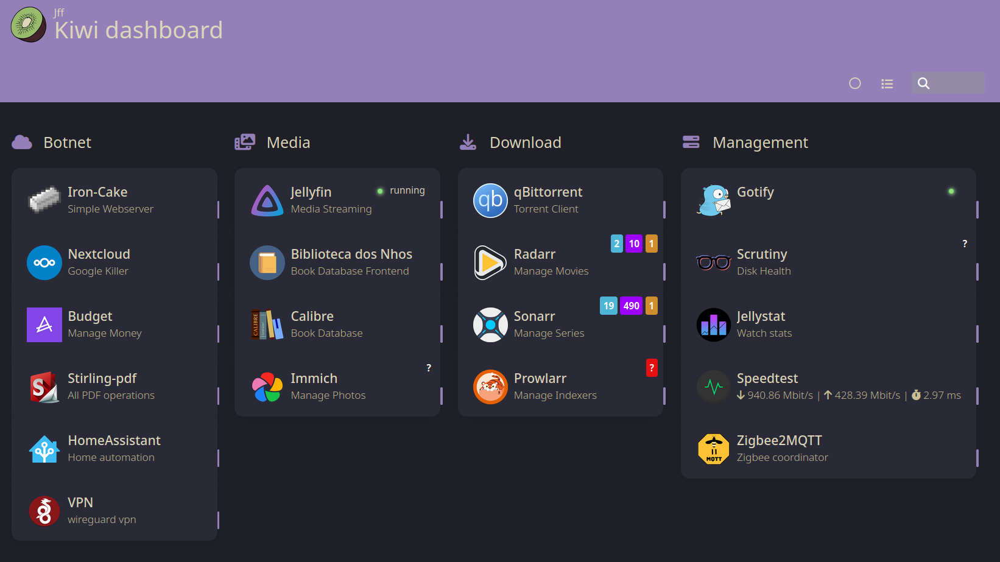

# 💼 suitcase

Manage my Home Lab using Containerized Services and Docker-compose.

This collection of Open Source programs is used daily by my GF and I.

## :hammer: Services

## :robot: Others
* [JBB.py](https://github.com/josefilipeferreira/JBB.py): MiEI Discord bot
* [watchtower](https://containrrr.dev/watchtower/): Automatic Docker Updates
